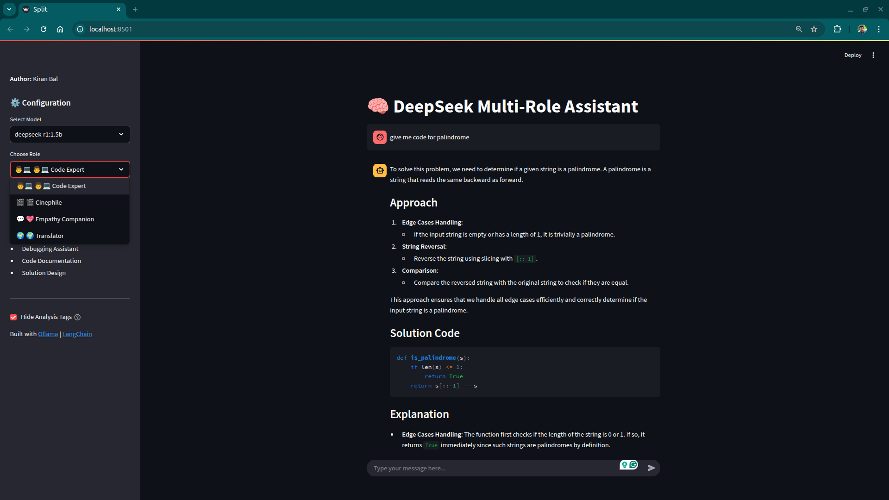
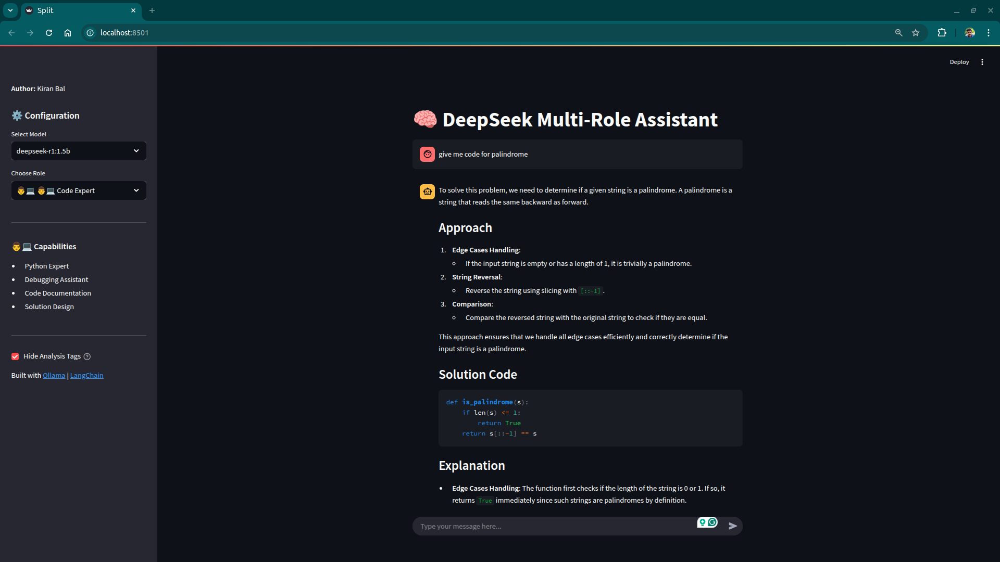
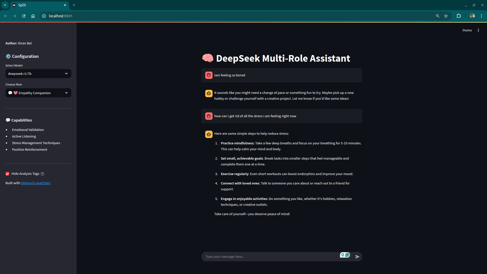
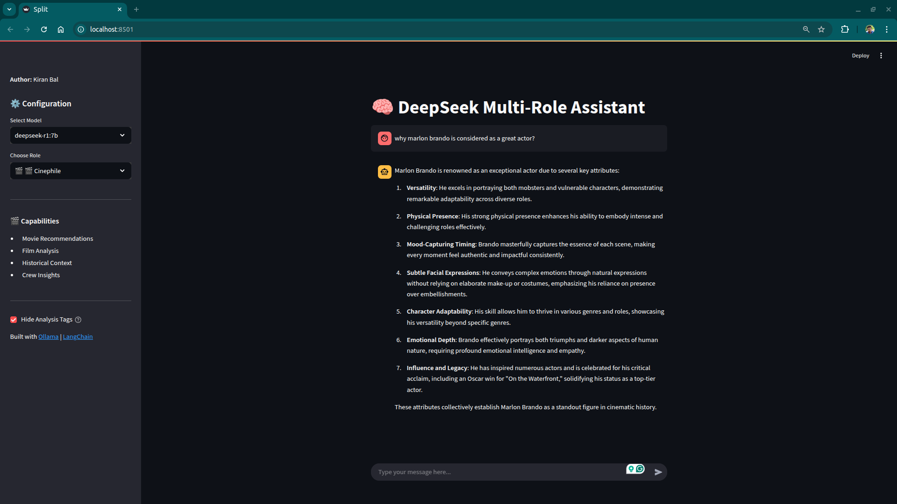
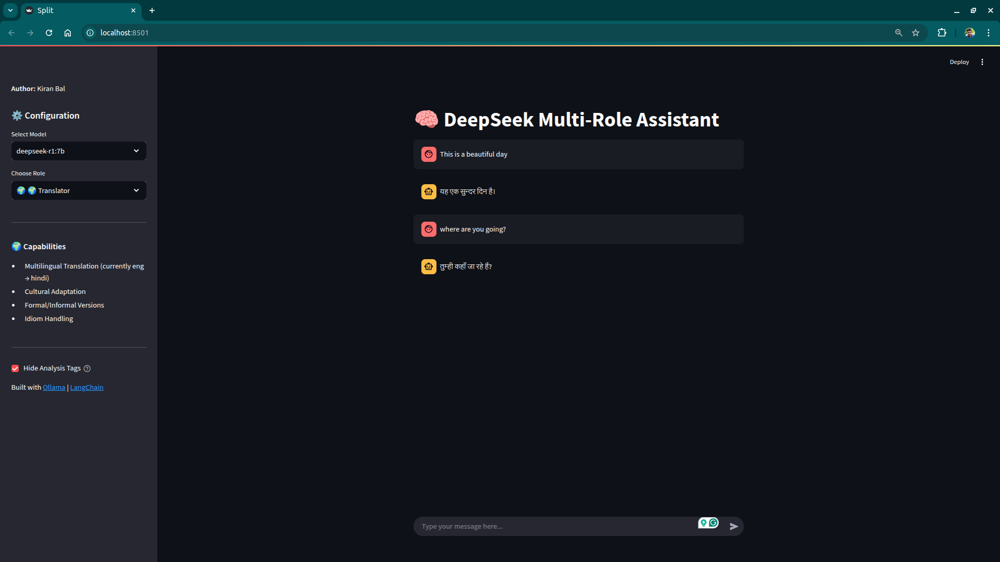
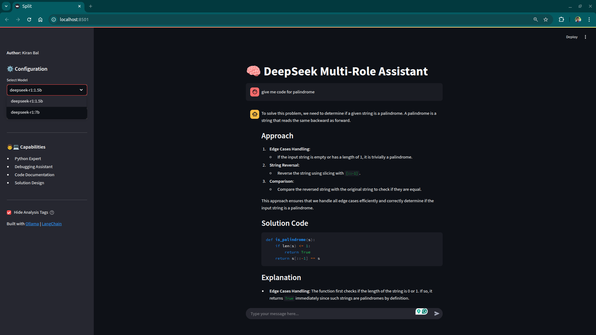

# 🚀 DeepSeek Multi-Persona Chatbot 🎭  
A multi-role AI assistant powered by **DeepSeek** models. This chatbot seamlessly **switches between different personalities** to assist with various tasks like coding, emotional support, movie recommendations, and more.  

  

## 🌟 Features  
✅ **Multi-Persona AI** – Supports different personalities like Code Expert, Movie Enthusiast, Emotional Support, and more.  
✅ **DeepSeek Model Integration** – Switch between DeepSeek models based on your needs (speed, accuracy, knowledge).  
✅ **Modular & Extensible** – Easily add new roles like ChefBot, GardenBot, or any custom assistant.  
✅ **Context-Aware Responses** – Adapts to your conversation flow.  
✅ **Translation Support** – Currently supports **English to Hindi** (more languages coming soon!).  
✅ **Easy Setup & Deployment** – Designed to be lightweight and customizable.  

---

## 📸 **Screenshots**  

| Feature | Screenshot |
|---------|-----------|
| **Coding Assistant Mode** |  |
| **Emotional Support Buddy** |  |
| **Movie Enthusiast Mode** |  |
| **Language Translator** |  |
| **Model Toggle Menu** |  |

---

## 🚀 **Getting Started**  

### **1️⃣ Prerequisites**  
Make sure you have the following installed:  
- [Python 3.11](https://www.python.org/downloads/)  
- [pip](https://pip.pypa.io/en/stable/installation/)  
- [Git](https://git-scm.com/downloads)  

### **2️⃣ Clone the Repository**  
```bash
git clone https://github.com/your-username/DeepSeek-MultiPersona-Chatbot.git
cd DeepSeek-MultiPersona-Chatbot
```

### **3️⃣ Create virtual environment**

```bash
python3 -m venv venv
source venv/bin/activate


pip install -r requirements.txt
```
### **4️⃣ Install ollama and deepseek model**

```bash

curl -fsSL https://ollama.com/install.sh | sh
ollama run deepseek-r1:1.5b
```

### **5️⃣ Run the chatbot**

```bash
streamlit run main.py
```


## 🛠 Customization & Adding New Roles

Steps to Add a New Role:

    1. Navigate to the roles/ directory – This contains persona logic.
    2. Create a new Python file for the new persona (e.g., chef_bot.py).
    3. Implement the persona's behavior using functions.

🎭 The chatbot will now recognize the new role!


## 🎥 Demo Video

📌 Coming soon!


## 📜 License

This project is licensed under the MIT License.